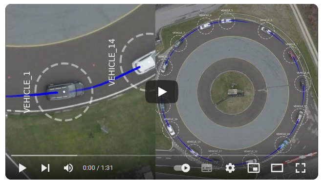

# Vehicle Trajectory Extraction With Oriented Object Detection

Watch on Youtube:
[](https://www.youtube.com/watch?v=R8mvTePXp6M&t)

## Introduction:
Vehicle trajectories offer valuable insights for a wide range of road transportation applications. Due to the rise of drone technology, a growing branch of literature explores optical vehicle trajectory extraction from aerial videos, where object detection using neural networks is an important component. Horizontal bounding box object detection struggles to differentiate well between rotated vehicles, especially when dealing with complex backgrounds or densely packed vehicles. 

This work proposes a generalizable computation pipeline that leverages angular information to extract high-quality trajectories starting from video recordings and ending in trajectories in Cartesian and lane coordinates. A trajectory reconstruction algorithm is designed to be vehicle- and driver-informed and to maximize the physical consistency of the reconstructed trajectories both on the individual vehicles’ and platoon levels. A benchmark of 18 object detection models on a real-world video dataset demonstrates how oriented object detection and the use of angular information can be used to significantly improve the consistency of extracted trajectories (15% better internal, and 20% better platoon consistency), and that orientation-informed trajectories can be reconstructed to lane coordinates of higher quality. The reconstructed vehicle trajectories better capture car-following and traffic dynamics, thereby improving their usability for traffic flow studies.

## What you will find in this repository

## Installation Instructions
The software pipeline is based on Python 3.8, and requires a list of packages that can be found in
- requirements.txt
- mfc_env_requirements.txt

The first requirements are used for the main part of the pipeline, while second file is used for trajectory reconstruction part of the pipeline.

## Acknowledgements:
We thank the Schweizer Radio und Fernsehen (SRF, Swiss Radio and Television, TV-show Einstein from May 2nd 2024), Adrian Winkler, Laurin Merz, and Andrea Fischli for their support when organizing participants and vehicles for the experiment, and filming and documenting it for the Swiss public. We thank Andre Greif and the TCS Driver Training Center in Derendingen, Solothurn (Switzerland) for hosting our experiment. We thank Patrick Langer, and Fan Wu for their helpful suggestions when writing and using computational facilities for vehicle trajectory extraction.

## Dataset:
[Dataset available on Zenodo 10.5281/zenodo.15124430](https://zenodo.org/records/15124431)

## Publications:
```
Consistent Vehicle Trajectory Extraction From Aerial Recordings Using Oriented Object Detection.
Riehl, K. and El-Baklish, S.K. and Kouvelas, T. and Makridis, M. 2025. (Submitted to Scientific Reports).
```

```
Aerial Video & Trajectory Dataset Of Vehicles On Circular Road.
Riehl, K. and El-Baklish, S.K. and Kouvelas, T. and Makridis, M. 2025. (Submitted to Data in Briefs).
```
